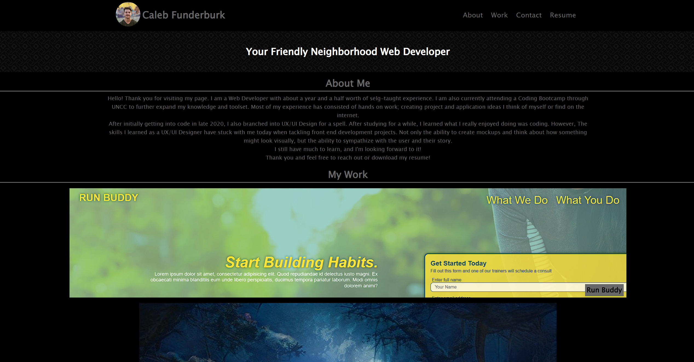

# Hydrangea

## Website

https://calebfunderburk.github.io/Hydrangea/

## Built With

- HTML
- CSS

## Project Narrative

### About

In this project I decided to create a website that will house all of my work and act as a point of contact for future employers. I started this project by creating a mockup in my notebook to get some ideas flowing. Next I took my ideas to VS Code and started typing out the basic HTML. Once the body of the page was coded, I started applying very basic positioning to my elements using CSS. After that, I decided to start with my Media Query's. My thought process here was to create a page that would first look good on a mobile device, and then adjust the css to format it for a desktop. I feel like this actually went pretty well. Next, I added some simple styling  to the page. I decided to give it a 'dark mode' kind of look. At the end, all I had left to do was make sure all of my links worked and deploy the page.
Thank you!

### Placeholder Content

Run Buddy, Cook It!, and Wicked Wizard are simply placeholders until I finish more projects to fill in these spaces. Using these placeholders help by making future updates easier to implement.

### Photo Credits

- profile-pic.jpg by Dilon Ballard
- wizard.jpg, & food.jpg were provided by pixabay.com
- curls.webp was provided by toptal.com
- run-buddy.png is a screenshot of a project I worked in Coding Boot Camp

## Screenshot

## Contributions

Made by Caleb Funderburk